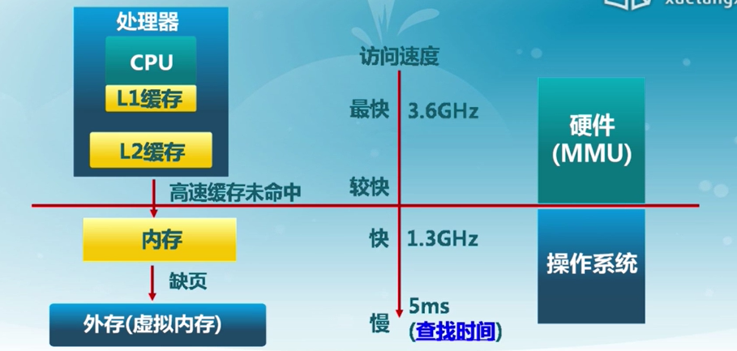

# 物理内存管理

## 内存层次结构

### 地址生成

物理地址空间：硬件支持的地址空间；逻辑地址空间：在CPU运行的进程看到的地址

地址转换过程：编译、汇编、链接、加载（重定位）

地址生成时机：

1. 编译。在程序中把地址写死，编译时生成地址
2. 加载。程序加载时重定位生成地址
3. 执行。在执行到当前指令时生成地址

由地址控制单元MMU（硬件）对逻辑地址和物理地址进行转换，但**地址映射表（段表、页表等）由操作系统建立**。

## 连续内存分配

连续内存分配：给进程指定一块不小于指定大小的连续的物理内存区域

内存碎片：分配单元之间的未被使用的碎片（外碎片）；分配单元内部的未被使用的碎片（内碎片），取决于分配单元大小是否要取整

